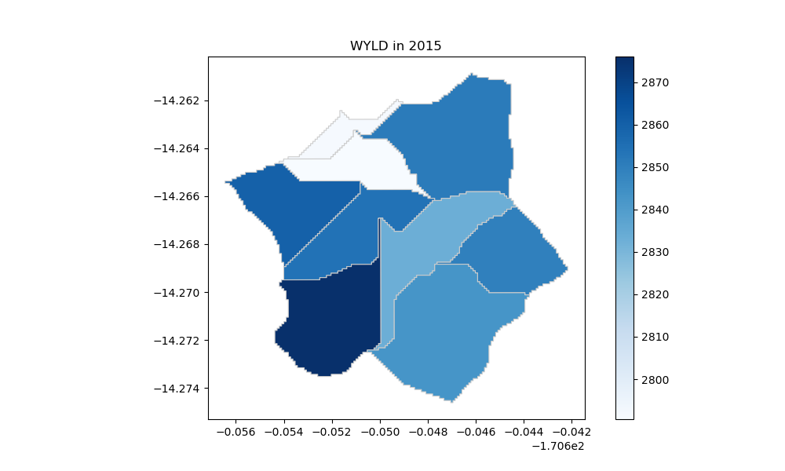

# Deep Learning to attempt a phenominoligical Watershed Model 
 Using machine learning to break the boundaries of physically based watershed models

Note this project is in progress...

### Premise 
Watershed models, such as the Soil & Water Assessment Tool (SWAT) are industry standard tools for providing quantitative estimates of water, nutrient, and sediment outflows in streams, assessing impacts to watersheds from environmental changes, and estimating components of the water budget, such as surface runoff and baseflow discharge. Traditional watershed models are physically-based models, meaning they are founded upon the mathematical equations that we have developed to understand natural processes around us. However, natural systems are inherently complicated, and if our conceptual models are over-simplified, physically-based models may yield less than satisfactory results; often producing the right answers, but for the wrong reasons. Conversely, deep neural networks, a form of machine learning, have recently become a popular way to solve problems where the exact mathematical relationships between inputs and outputs have not been constrained by our presuppositions of the world. Neural networks have been widely applied to develop tools and empirical models of everything from optimizing groundwater management to predicting the stock market. In this study, we test the hypothesis that a neural network, provided with the same input information as provided to a physically based watershed model, can yield predictions of output parameters with a higher degree of certainty than can be produced by, specifically a SWAT watershed model. Preliminary results indicate that deep learning technology is promising and when provided with enough input data, can produce results that rival outputs of the physically-based SWAT models. This frontier in computing has significant potential to supplement the water manager’s existing toolkit, and someday may even replace physically based models entirely. 

Solarized dark             |  Solarized Ocean
:-------------------------:|:-------------------------:
  |  

